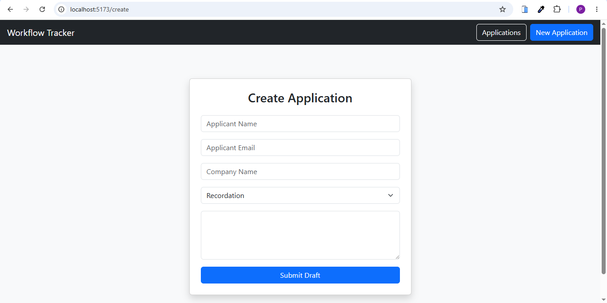
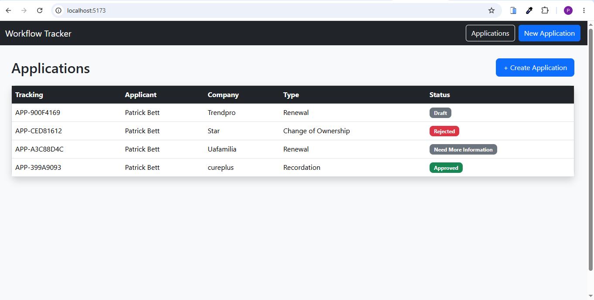
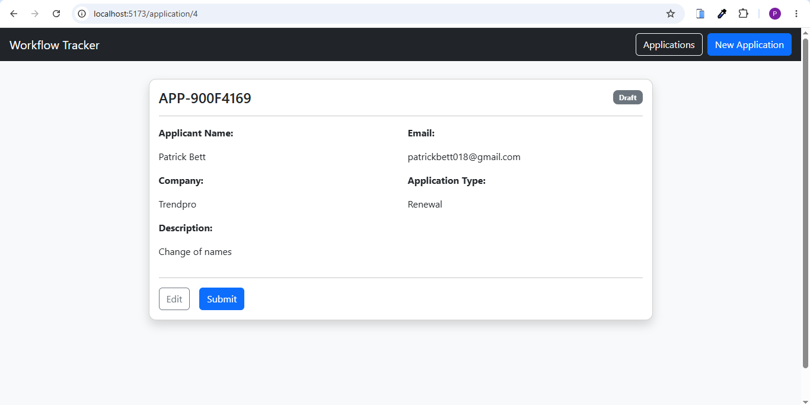
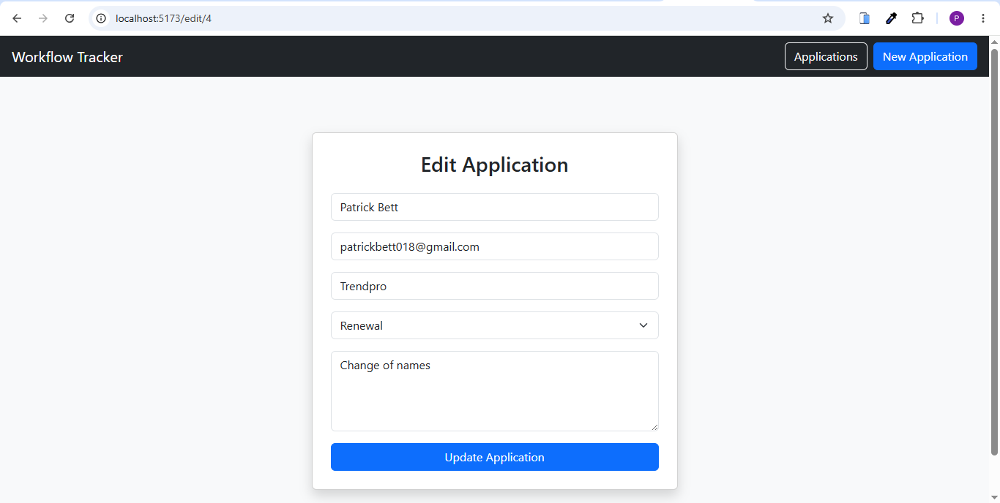
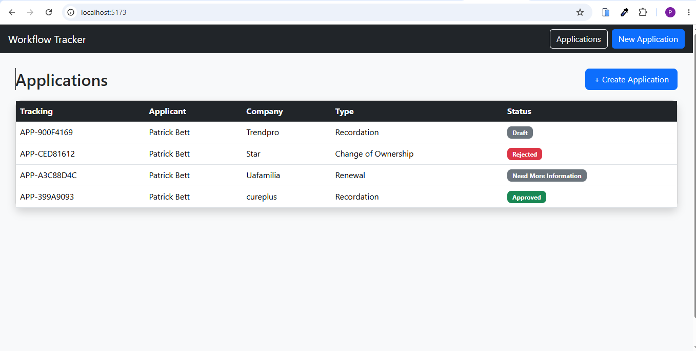
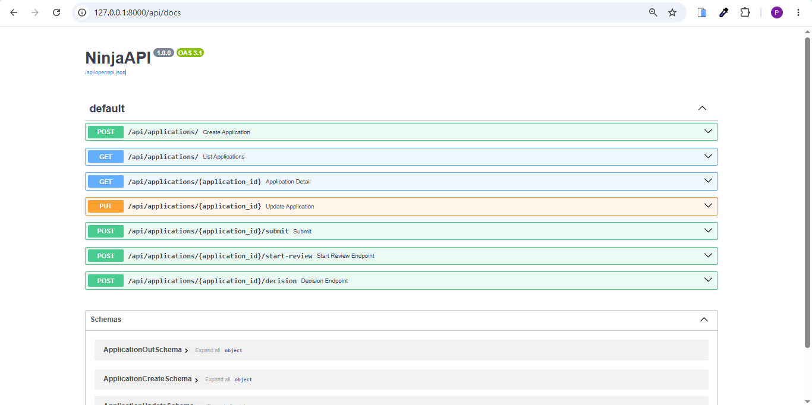
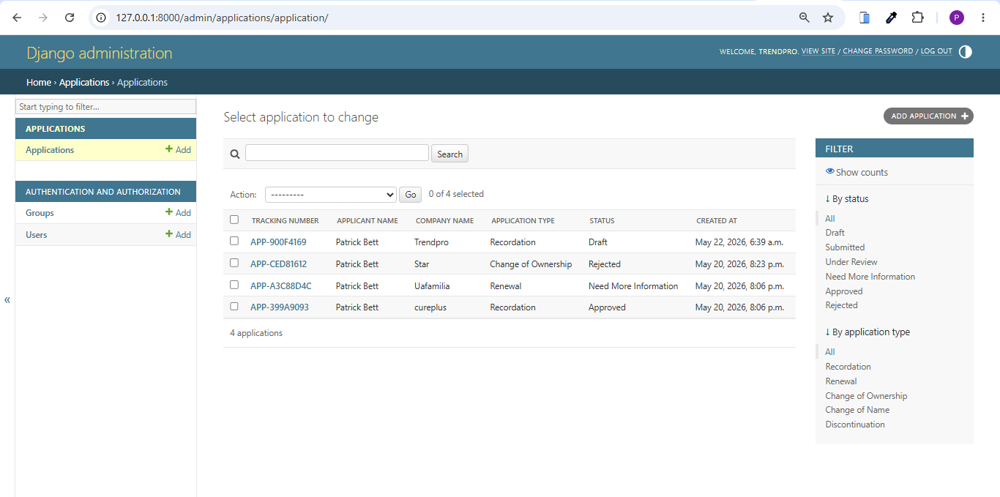

# Workflow Tracker — Mini Application Workflow Tracker

A full-stack workflow tracking application built with React and Django Ninja for managing application review workflows.

This project was developed as part of a take-home assignment for a Junior–Mid Django/React Full-Stack Developer role.

---

# Project Overview

The application allows users to:

* Create application drafts
* Submit applications for review
* Track workflow status
* Review and make decisions on applications
* Request additional information
* Approve or reject submissions

The workflow lifecycle implemented is:

```text
Draft → Submitted → Under Review → Approved / Rejected / Need More Information
```

Applications marked as **Need More Information** can be edited and resubmitted.

---

# Tech Stack

## Backend

* Python
* Django
* Django Ninja
* SQLite

## Frontend

* React.js
* React Router DOM
* Axios
* Bootstrap 5

---

# Features Implemented

## Backend Features

### Application Model

The system includes the following fields:

* tracking_number
* applicant_name
* applicant_email
* company_name
* application_type
* description
* status
* reviewer_comment
* created_at
* updated_at
* submitted_at
* reviewed_at

---

## Application Types

Supported application types:

* Recordation
* Renewal
* Change of Ownership
* Change of Name
* Discontinuation

---

## Workflow Statuses

Supported statuses:

* Draft
* Submitted
* Under Review
* Need More Information
* Approved
* Rejected

---

## API Endpoints

| Method | Endpoint                              | Description              |
| ------ | ------------------------------------- | ------------------------ |
| POST   | `/api/applications/`                  | Create application draft |
| GET    | `/api/applications/`                  | List applications        |
| GET    | `/api/applications/{id}`              | View application details |
| PUT    | `/api/applications/{id}`              | Update draft application |
| POST   | `/api/applications/{id}/submit`       | Submit application       |
| POST   | `/api/applications/{id}/start-review` | Start review             |
| POST   | `/api/applications/{id}/decision`     | Record reviewer decision |

---

## Workflow Rules Implemented

### Draft

* Can be edited
* Can be submitted

### Submitted

* Can move to Under Review

### Under Review

* Can receive reviewer decisions:

  * Approved
  * Rejected
  * Need More Information

### Need More Information

* Can be edited
* Can be resubmitted

### Approved / Rejected

* Cannot be edited

### Reviewer Decision Validation

* Reviewer comments are required for:

  * Rejected
  * Need More Information

---

# Frontend Features

## Application List Screen

Displays:

* Tracking number
* Applicant name
* Company name
* Application type
* Status

---

## Create/Edit Application Form

Users can:

* Create application drafts
* Edit drafts
* Resubmit applications requiring more information

---

## Application Detail Screen

Displays:

* Full application details
* Workflow status
* Reviewer comments
* Available workflow actions

---

## Reviewer Actions

Actions displayed dynamically based on workflow status.

### Draft

* Edit
* Submit

### Submitted

* Start Review

### Under Review

* Approve
* Need More Information
* Reject

### Need More Information

* Edit
* Resubmit

### Approved / Rejected

* No further actions available

---

# Frontend Structure

```bash
frontend/
│
├── src/
│   ├── api/
│   │   └── api.js
│   │
│   ├── components/
│   │   ├── Navbar.jsx
│   │   ├── ReviewerActions.jsx
│   │   └── StatusBadge.jsx
│   │
│   ├── pages/
│   │   ├── ApplicationList.jsx
│   │   ├── ApplicationDetail.jsx
│   │   └── ApplicationForm.jsx
│   │
│   ├── App.jsx
│   └── main.jsx
```

---

# Backend Structure

```bash
workflow_tracker/
│
├── applications/
│   ├── models.py
│   ├── schemas.py
│   ├── api.py
│   ├── services.py
│   └── migrations/
│
├── workflow_tracker/
│   ├── settings.py
│   ├── urls.py
│   └── asgi.py
│
├── manage.py
└── requirements.txt
```

---

# Running the Backend

## 1. Navigate to Backend

```bash
cd workflow_tracker
```

---

## 2. Create Virtual Environment

```bash
python -m venv venv
```

---

## 3. Activate Environment

### Windows

```bash
venv\Scripts\activate
```

### Linux/macOS

```bash
source venv/bin/activate
```

---

## 4. Install Dependencies

```bash
pip install -r requirements.txt
```

---

## 5. Run Migrations

```bash
python manage.py makemigrations
python manage.py migrate
```

---

## 6. Start Server

```bash
python manage.py runserver
```

Backend runs at:

```bash
http://127.0.0.1:8000
```

---

# Running the Frontend

## 1. Navigate to Frontend

```bash
cd frontend
```

---

## 2. Install Dependencies

```bash
npm install
```

---

## 3. Start Frontend

```bash
npm run dev
```

Frontend runs at:

```bash
http://localhost:5173
```

---

# API Configuration

Axios configuration:

```javascript
const API = axios.create({
  baseURL: "http://127.0.0.1:8000/api",
});
```

Located in:

```bash
src/api/api.js
```

---

# Assumptions Made

* No authentication system was required for the assignment.
* Reviewer actions are accessible directly from the UI.
* SQLite was used for simplicity and fast setup.
* Workflow actions are enforced on the backend.
* Tracking numbers are generated automatically.

---

# What I Would Improve With More Time

## Backend Improvements

* Add authentication and role-based permissions
* Add automated tests
* Add pagination and filtering
* Add API validation improvements
* Add audit logs/history tracking

---

## Frontend Improvements

* Improve form validation
* Add toast notifications
* Add loading and error states everywhere
* Add search and filtering
* Improve mobile responsiveness

---

## DevOps Improvements

* Dockerize the application
* Add CI/CD pipelines
* Add production environment configuration
* Deploy to AWS or Render

---

# Screenshots / Walkthrough

Optional screenshots or walkthrough video can be added here.







---

# Author


Developer: Patrick Kipngetich Bett
Email: patrickbett018@gmail.com
